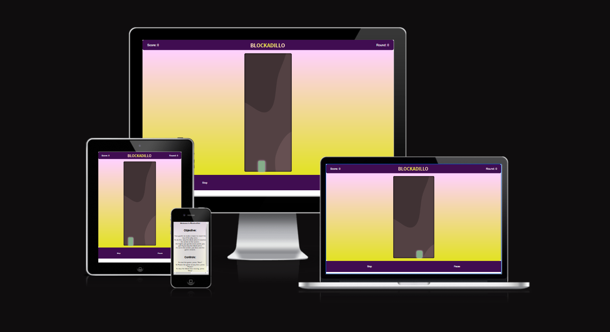
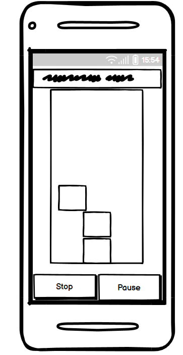
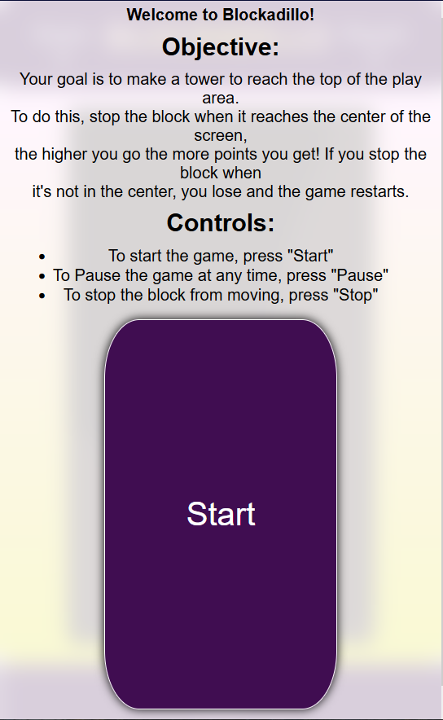
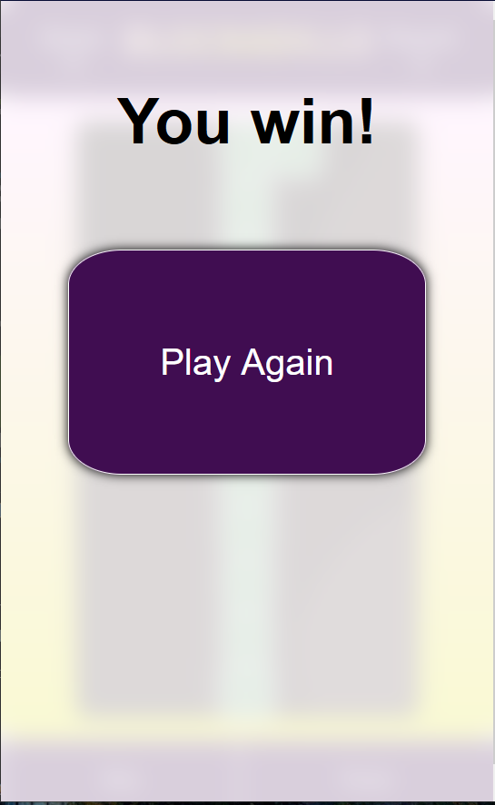
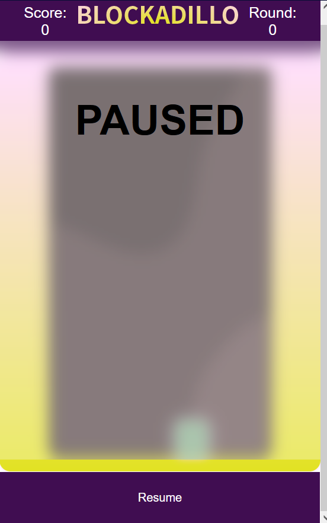
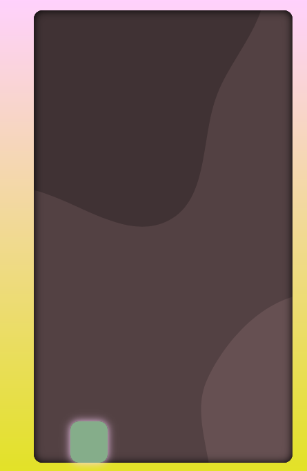
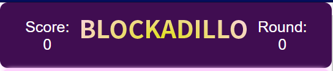

# Blockadillo

This is a simple block stacking game built with HTML, CSS, and JavaScript. The game involves moving a block horizontally across a grid and trying to line it up with the center column. If the block is lined up, the player scores a point and a new block is created. The game ends when the player reaches a certain number of points or when they fail to line up the block.
Getting Started

To play the game, simply open the index.html file in a web browser. No additional installation or configuration is required.

## Game Controls

    Click the "Start" button to start the game.
    Click the "Stop" button to stop the block.
    Click anywhere on the game board to stop the block.
    Click the "Pause" button to pause the game.
    Click the "Resume" button to resume the game.

## Game Rules

    The Block moves from left to right automatically.
    Try to line up the block with the center column.
    If the block is lined up, you score a point and a new block is created.
    If you reach a the top of the screen, you win the game.
    If you fail to line up the block, the game ends.

## Design 

I wanted to implement a mobile first design and started from mobile and worked my way out. I used  Noto Sans JP for my font and color mind for my colour scheme.

## Features 
The site includes a fully playable game, it starts with player information:

 It has a win screen: 
 
 
 
 and a pause screen: 
 
 . 
 
 With buttons for pause and stopping the block:
 
   

  or by clicking the background of the game:
  
  

  It also includes a game banner with score and rounds:

  

The block is created by adding a class to the grid container. The block moves using the setInterval function, and it gets faster as the block moves up the container. I had an issue with this function where the block would have a second interval after game reset, but was solved by having clearInterval in the right place.

## Additional future features.
I wanted to add a few more things into the game but unfortunately due to personal time constraints I wasn't able to implement everything I wanted. I hope to continue this project later on and make it as I wanted.

1. Rounds System: I started to implement but didn't get time to finish, I wanted to have it so you could go for 3 rounds, and have your score total the average of the 3.
1. Leaderboards: Save the last 10 scores and rank them from highest to lowest.
1. Multiplayer: Add a second grid container and have players compete against each other for the higher score
1. API: I wanted to add a weather API to demonstrate the use, and change the background depending on the weather.

## Testing 
### Requirements

Blockadillo should meet the following requirements:

   1. The game should start when the user clicks the "start" button
   1. A block should move from left to right across the screen
   1. The user should be able to pause the game
   1. The game should end when the block is not aligned with the center column
   1. The game should keep track of the user's score
   1. The game should keep track of the current round
   1. The game should have a total of 3 rounds
   1. The user should win if they score 10 points
   1. The game should reset after each round

Testing Methodology

The following tests were performed to ensure that the block game met the requirements:

    Start the game by clicking the "start" button
        Expected result: The game starts and a block moves from left to right across the screen
    Pause the game by clicking the "pause" button
        Expected result: The game is paused and the block stops moving
    Resume the game by clicking the "resume" button
        Expected result: The game resumes and the block continues moving
    Stop the block by clicking the "stop" button
        Expected result: The block stops and checks if it is aligned with the center column
    Score 10 points to win the game
        Expected result: The game ends and the user wins
    Play through all 3 rounds
        Expected result: The game resets after each round and the user can continue playing until they win or lose

Results
| Test | Result    | Pass/Fail   |
| :---:   | :---: | :---: |
| 1 | Pass   | Pass   |
| 2 | Pass   | Pass   |
| 3 | Pass   | Pass   |
| 4 | Pass   | Pass   |
| 5 | Pass   | Pass   |
| 6 | N/A   | Fail   |

## Deployment

Prerequisites

Before deploying the site, you will need the following:

    A GitHub account
    A GitHub repository containing the website's code
    The website's code should be static, i.e., HTML, CSS, and JavaScript files

Steps to Deploy The Website Using GitHub Pages

    Create a new branch named "gh-pages" in the GitHub repository. This branch will be used to host the website.
    Push the website's code to the "gh-pages" branch.
    On the repository's settings page, scroll down to the "GitHub Pages" section.
    In the "Source" section, select "gh-pages" as the branch and "/root" as the folder.
    Click the "Save" button to save the changes.
    Wait a few minutes for GitHub Pages to build and deploy your website.
    The website will now be available at https://<username>.github.io/<repository-name>/

Updating The Website

Whenever you want to update the website, you can simply push the changes to the "gh-pages" branch, and GitHub Pages will automatically rebuild and deploy the updated website.

## Bugs
1. I had an issue where sometimes the overlays don't appear when the game resets, and was hard to replicate, but adding a clear to the classes on reset mostly solves it.

1. The animation on the block isn't smooth and I wasn't sure how to solve it, when it moves left and right it sometimes "hangs" on the left side, and I wasn't able to make it smoother.

1. The rounds function doesn't work as expected

## Acknowledgements
Game was inspired by the arcade game Stacker.
I used http://colormind.io/ to help with my colour pallet
I used https://bgjar.com for the code for the SVG background, Google for the fonts
